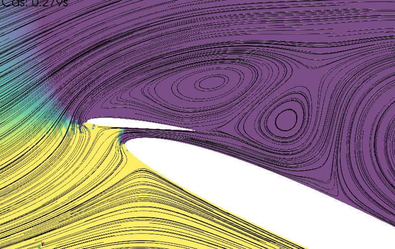
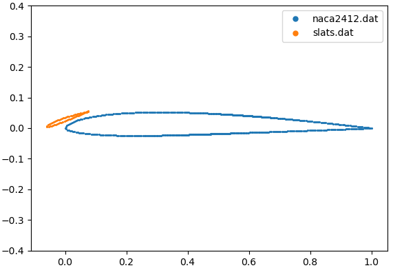
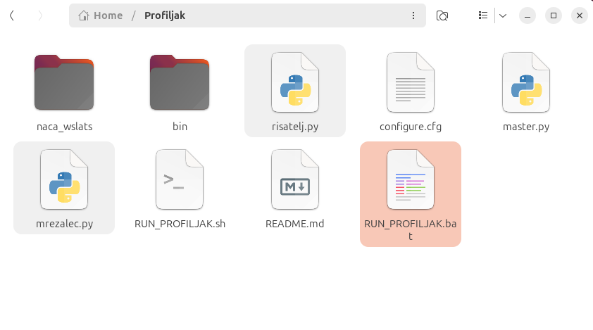
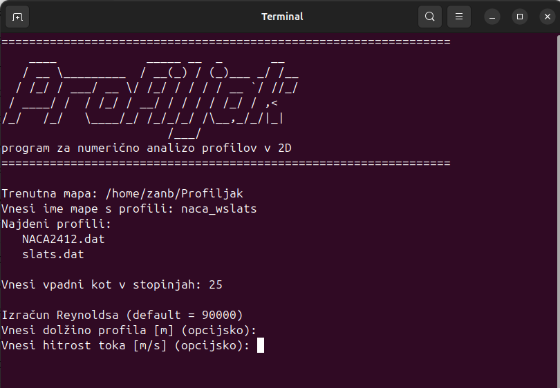
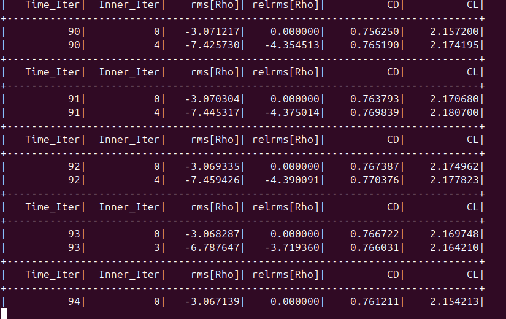
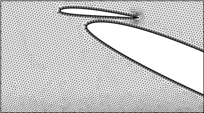
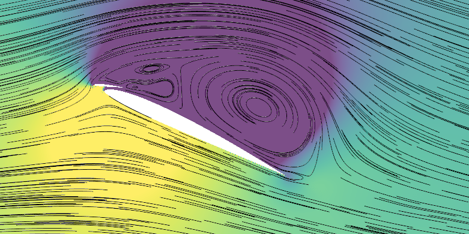

# *"Profiljak"* - paket za analizo 2D profilov v netrivialnih konfiguracijah.

# Navodila za namestitev

## Potrebščine:
   - WSL (Windows Subsystem for Linux) ali Linux/Mac OS - v slednjem primeru spustimo prvi korak,
   - python 3.8 ali novejši s knjižnjicami numpy, os, glob, pyvista,
   - gmsh - program za generiranje mrež,
   - SU2 - delovni konj.

## Nameščanje WSL

1. Zaženemo PowerShell kot skrbnik (*Win + X + A*  -->  *PowerShell (Admin)*),
2. Vnesemo ukaz:

   `wsl --install`

3. Če je potrebno, znova zaženemo PC. Po ponovnem zagonu zaženemo Ubuntu (WSL) in nastavimo uporabniško ime ter geslo zanj.

## Nameščanje paketov (od tukaj dalje delamo v terminalu Ubuntu (WSL))

Zaženemo ukaza:

   `sudo apt update && sudo apt install -y
      build-essential cmake python3 python3-pip
      libopenmpi-dev openmpi-bin git`

in:

   `pip3 install pyvista`

## Nalaganje paketa Profiljak z SU2

Prenesemo repozitorij:
   https://github.com/butalazan/Profiljak/

ali preprosto zaženemo:

   `git clone https://github.com/butalazan/Profiljak.git
   cd Profiljak`

## (Opcijsko) Dodajanje sistemske poti (PATH)

Zaženemo (spremenimo HOME/Profiljak/ v pot do bin datoteke):

   `echo 'export PATH=$PATH:$HOME/Profiljak/bin' >> ~/.bashrc
   source ~/.bashrc`

To omogoči uporabo SU2 ukazov iz katere koli mape.

  

# Navodila za uporabo Profiljak paketa

V CAD programu narišemo poljuben profil, ter koordinate točk izvozimo v tekstovno datoteko *.dat ali *.txt.

  
OPOMBA: koordinate profila so brezdimenzijske in zajemajo vrednosti od 0 do 1 vzdolž x-osi. Predkrilca, in dodatki lahko segajo največ 15% izven intervala. Velikosti in hitrosti v metričnih enotah določimo naknadno.

OPOMBA: če je profil iz več delov, ki se ne prekrivajo (npr. predkrilca), vsakega od njih izvozimo v svojo tekstovno datoteko.

Datoteke profila/-ov (npr. naca2412.dat in slats.dat) nato shranimo v podmapo (npr. naca_wslats).

 

Zaženemo batch file RUN_PROFILJAK.bat (v Linux OS: RUN_PROFILJAK.sh)

 

Odpre se okno, ki nas vodi po korakih:
   1) vnesemo ime mape, kjer se nahajajo datoteke s koordinatami profilov,
   1) vnesemo vpadni kot v stopinjah,
   1) (po potrebi) vnesemo dolžino profila [m] in hitrost [m/s] za izračun Re.

Program generira mrežo in požene simulacijo, ki lahko traja nekaj ur.

Po koncu najdemo podmape
   - naca_wslats
      - vtus,
      - dats,
      - slike,
      - rezultati.

<!--<figcaption><strong>Slika 7:</strong> Mreža.</figcaption> -->

<figcaption><strong>Slika 8:</strong> Tlačno polje s tokovnicami.</figcaption>

   

*Drobni tisk:
Program Profiljak je prirejen za osnovno reševanje tranzientnega Navier-Stokes sistema (URANS) s turbolenčnim modelom Spalart-Allmaras.
Gostota, viskoznost in ostale konstante so nastavljene za zrak na 0m nmv.
Program je v sestavljen iz opensource komponent gmsh za generiranje mrež in SU2 solverja N-S sistema.*
